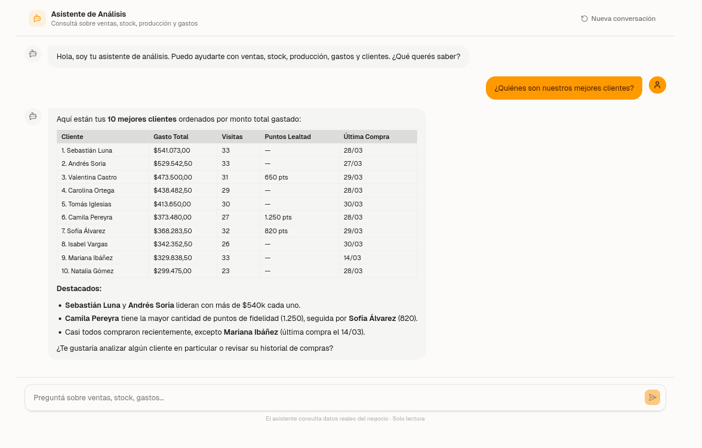
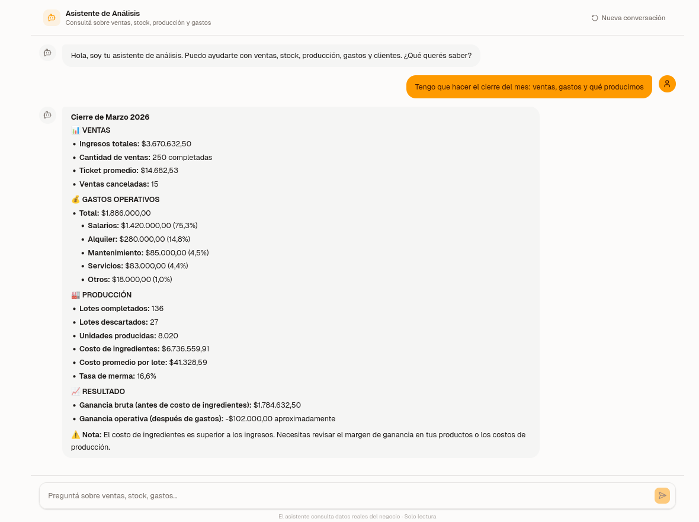
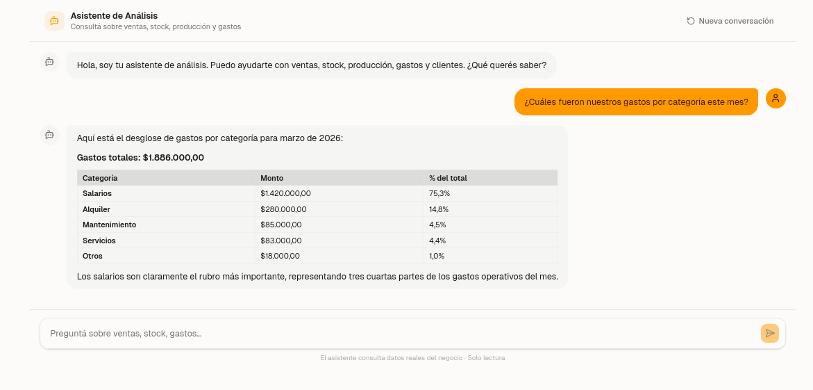
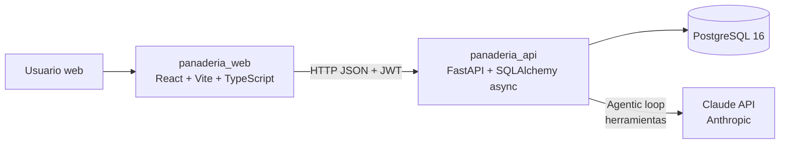
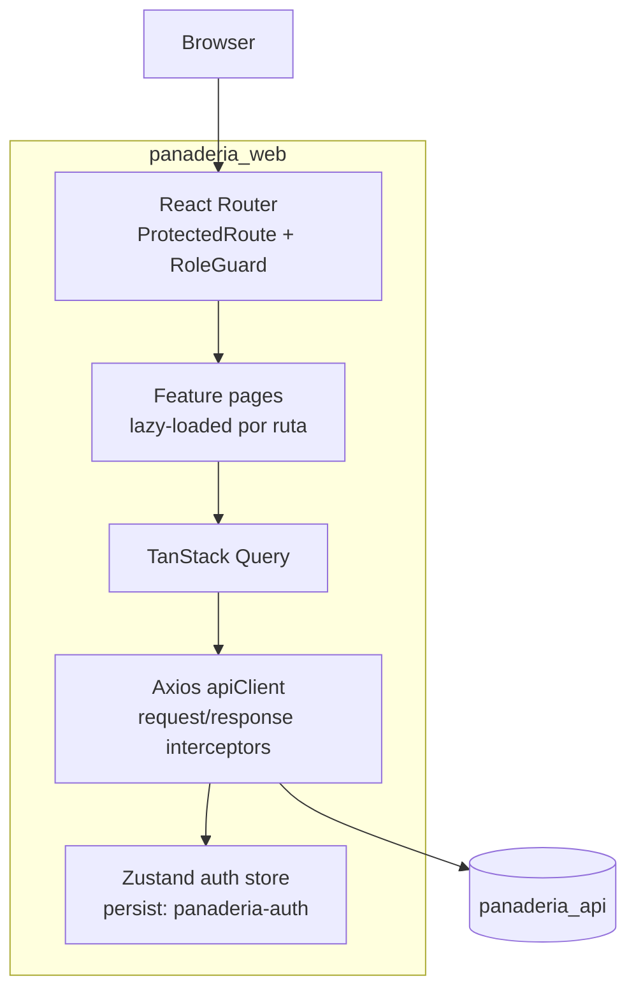
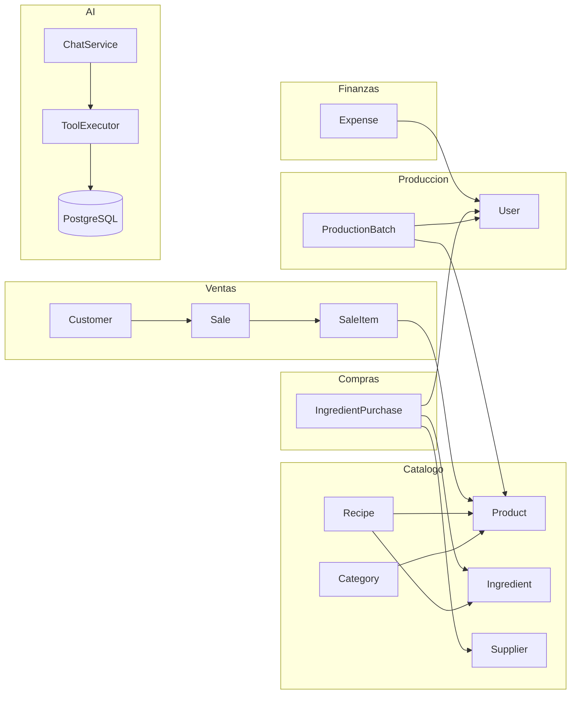

# Panaderia SaaS

**Demo:** https://bakery-pink-delta.vercel.app &nbsp;·&nbsp; usuario: `admin@panaderia.com` &nbsp;·&nbsp; contraseña: `admin123`

Sistema de gestion para panaderia artesanal con ventas en punto de venta, inventario de ingredientes, lotes de produccion y control financiero — con **asistente de analisis impulsado por IA** (Claude).

El repositorio es un monorepo con backend FastAPI, frontend React y base de datos PostgreSQL.

**Autor:** Felipe Peralta — Cuenca, Ecuador

---

## Asistente de Analisis con IA

El modulo de IA permite consultar el negocio en lenguaje natural. El asistente tiene acceso a herramientas que consultan la base de datos en tiempo real: ventas, stock, produccion, gastos, clientes y catalogo.

**Arquitectura:** Claude (Anthropic) recibe la pregunta del usuario, decide que herramientas ejecutar, consulta PostgreSQL a traves del backend FastAPI y devuelve una respuesta formateada con datos reales.

### Ejemplos de consultas

**Top clientes por facturacion**



**Cierre de mes: ventas, gastos y produccion**



**Desglose de gastos por categoria**



### Herramientas disponibles para el modelo

| Herramienta | Que hace |
|---|---|
| `get_sales_summary` | Totales de ventas por rango de fechas |
| `get_top_products` | Productos mas vendidos por cantidad o revenue |
| `get_stock_status` | Stock actual de productos, con alertas de minimo |
| `get_production_stats` | Lotes, unidades producidas, tasa de merma |
| `get_expense_summary` | Gastos operativos por categoria y periodo |
| `get_ingredient_cost_trend` | Evolucion de precio de compra de un ingrediente |
| `get_customer_stats` | Top clientes, puntos de fidelidad, frecuencia |
| `search_catalog` | Busqueda de nombres exactos en productos e ingredientes |

---

## Arquitectura General



### Frontend (panaderia_web)

- Stack: React 19, Vite 8, TypeScript 5.9.
- Routing: React Router con rutas protegidas y guard por rol.
- Estado de servidor: TanStack Query.
- Estado de cliente: Zustand persistente para sesion.
- HTTP: Axios con interceptor de refresh token y cola de requests en 401.
- UI: Tailwind + componentes UI locales (`src/components/ui`) + componentes de dominio (`src/components/shared`).
- Notificaciones: Sonner.
- Markdown: react-markdown + remark-gfm (respuestas del asistente con tablas y formato).

### Backend (panaderia_api)

- API REST asincrona con FastAPI.
- SQLAlchemy 2.0 async + asyncpg.
- Arquitectura por capas: rutas -> servicios -> repositorios.
- Autenticacion JWT con access/refresh.
- Reglas de negocio de ventas, produccion, compras, clientes y gastos implementadas en capa de servicios.
- Modulo AI: agentic loop con ventana de conversacion (5 turnos, TTL 30 min), tool executor sobre SQLAlchemy async.

---

## Flujo de Frontend



### Modulos de UI implementados

- Auth: login, logout, control de acceso por rol.
- Dashboard.
- Ventas: listado, nueva venta, detalle, cancelacion.
- Clientes: listado y detalle.
- Produccion: listado, creacion de lote, detalle, completar, descartar.
- Catalogo: categorias, productos, ingredientes, recetas.
- Inventario: stock, proveedores, compras de ingredientes.
- Finanzas: dashboard, gastos, reporte de ventas.
- Admin: overview, usuarios, cambio de contrasena.
- **Asistente AI: chat en lenguaje natural con acceso a datos reales del negocio.**

---

## Backend API y dominio



### Endpoints base (v1)

- `/api/v1/auth`
- `/api/v1/users`
- `/api/v1/categories`
- `/api/v1/products`
- `/api/v1/ingredients`
- `/api/v1/recipes`
- `/api/v1/customers`
- `/api/v1/sales`
- `/api/v1/production-batches`
- `/api/v1/ingredient-purchases`
- `/api/v1/suppliers`
- `/api/v1/expenses`
- `/api/v1/ai` — chat con el asistente de analisis

---

## Testing

### Frontend

- Unit/integration con Vitest + Testing Library + MSW.
- E2E con Playwright (proyecto chromium activo).
- Estado actual validado localmente:
  - `npm run test:run` -> 78 tests OK.
  - `npm run test:e2e` -> 19 tests OK.

### Backend

- Unit, API mocked e integracion con pytest.
- Estado actual validado localmente:
  - `uv run pytest` -> 173 tests OK.

---

## Deploy en Produccion

La aplicacion esta desplegada en:

| Servicio | Plataforma | URL |
|---|---|---|
| Frontend | Vercel | https://bakery-pink-delta.vercel.app |
| Backend API | Heroku (container stack) | `panaderia-api.herokuapp.com` |
| Base de datos | Heroku Postgres essential-0 | PostgreSQL 16 |

El deploy usa Docker en Heroku (container stack), Vercel con rewrite SPA y rate limiting sobre el endpoint AI para proteger el consumo de la API de Anthropic.

Para la documentacion completa del proceso — variables de entorno, problemas enfrentados, decisiones tecnicas y practicas aplicadas — ver [`docs/private/DEPLOY_MANUAL.md`](docs/DEPLOY_MANUAL.md).

---

## Quick Start (Docker)

Requisitos: Docker + Docker Compose.

```bash
git clone <repo-url>
cd panaderia

cp .env.example .env
# Agregar ANTHROPIC_API_KEY en .env para el modulo AI
docker compose up -d --build
```

Servicios:

- API: `http://localhost:8000`
- Swagger: `http://localhost:8000/docs`
- Frontend (dev): `http://localhost:5173` (levantandolo con `npm run dev` en `panaderia_web`)

---

## Desarrollo local

### Backend

```bash
cd panaderia_api
uv sync
uv run uvicorn main:app --reload
```

### Frontend

```bash
cd panaderia_web
npm install
npm run dev
```

Variables usadas por frontend:

- `VITE_API_URL`
- `VITE_LOYALTY_POINTS_RATIO`
- `VITE_APP_NAME` (opcional, con fallback)

Variables de backend relevantes para AI:

- `ANTHROPIC_API_KEY` — requerida para el asistente
- `AI_MODEL` — modelo a usar (default: `claude-haiku-4-5-20251001`)

---

## Estructura del repositorio

```text
panaderia/
├── panaderia_api/
│   ├── src/
│   │   ├── ai/                  <- modulo AI (client, tools, tool_executor, chat_service)
│   │   ├── api/v1/routes/
│   │   ├── core/
│   │   ├── middleware/
│   │   ├── models/
│   │   ├── repositories/
│   │   ├── schemas/
│   │   └── services/
│   └── tests/
├── panaderia_web/
│   ├── src/
│   │   ├── api/
│   │   ├── components/
│   │   ├── features/
│   │   │   └── ai/              <- AiAssistantPage, ChatWindow, MessageBubble, ChatInput, useAiChat
│   │   ├── hooks/
│   │   ├── lib/
│   │   └── test/
│   ├── playwright.config.ts
│   ├── vitest.config.ts
│   └── vite.config.ts
├── panaderia_db/
│   └── database/
│       ├── 00_init.sql
│       ├── 01_schema.sql
│       └── seeds.sql
├── docs/
│   ├── screenshots/
│   └── openapi.yaml
└── docker-compose.yml
```
