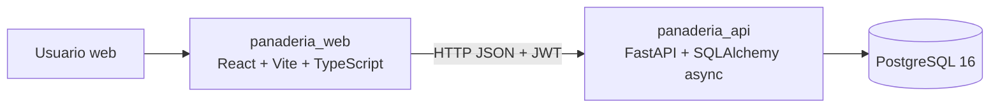
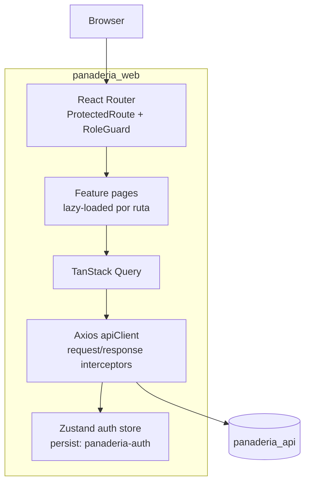
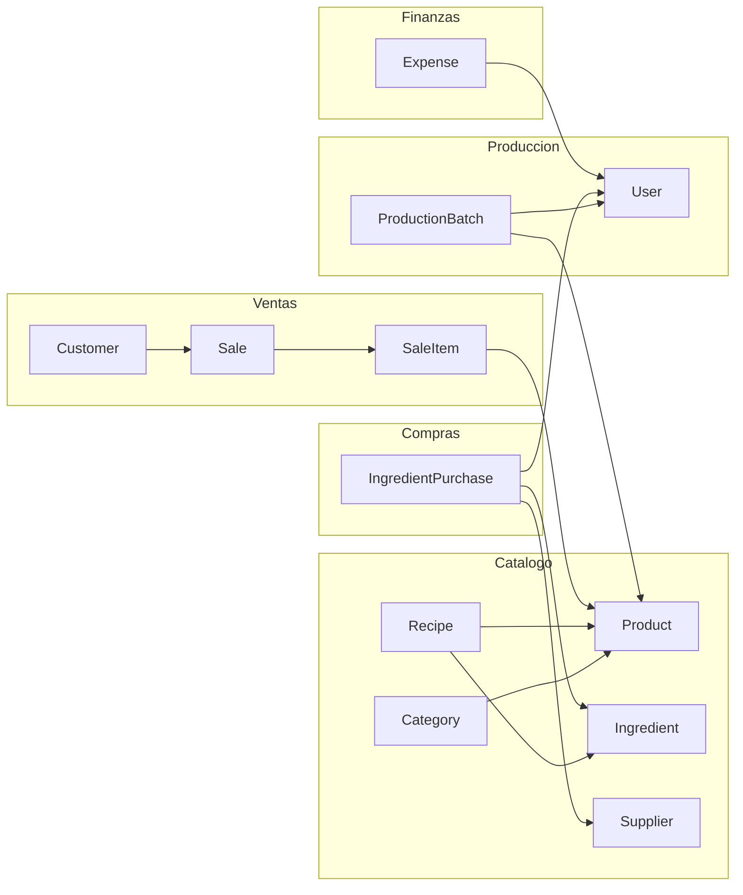

# Panaderia SaaS

Sistema de gestion para panaderia artesanal con ventas en punto de venta, inventario de ingredientes, lotes de produccion y control financiero. El repositorio es un monorepo con backend y frontend activos.

---

## Arquitectura General



### Frontend (panaderia_web)

- Stack: React 19, Vite 8, TypeScript 5.9.
- Routing: React Router con rutas protegidas y guard por rol.
- Estado de servidor: TanStack Query.
- Estado de cliente: Zustand persistente para sesion.
- HTTP: Axios con interceptor de refresh token y cola de requests en 401.
- UI: Tailwind + componentes UI locales (`src/components/ui`) + componentes de dominio (`src/components/shared`).
- Notificaciones: Sonner.

### Backend (panaderia_api)

- API REST asincrona con FastAPI.
- SQLAlchemy 2.0 async + asyncpg.
- Arquitectura por capas: rutas -> servicios -> repositorios.
- Autenticacion JWT con access/refresh.
- Reglas de negocio de ventas, produccion, compras, clientes y gastos implementadas en capa de servicios.

---

## Flujo de Frontend



### Modulos de UI implementados

- Auth: login, logout, control de acceso por rol.
- Dashboard.
- Ventas: listado, nueva venta, detalle, cancelacion.
- Clientes: listado y detalle.
- Produccion: listado, creacion de lote, detalle, completar, descartar.
- Catalogo: categorias, productos, ingredientes, recetas.
- Inventario: stock, proveedores, compras de ingredientes.
- Finanzas: dashboard, gastos, reporte de ventas.
- Admin: overview, usuarios, cambio de contrasena.

---

## Backend API y dominio



### Endpoints base (v1)

- `/api/v1/auth`
- `/api/v1/users`
- `/api/v1/categories`
- `/api/v1/products`
- `/api/v1/ingredients`
- `/api/v1/recipes`
- `/api/v1/customers`
- `/api/v1/sales`
- `/api/v1/production-batches`
- `/api/v1/ingredient-purchases`
- `/api/v1/suppliers`
- `/api/v1/expenses`

---

## Testing

### Frontend

- Unit/integration con Vitest + Testing Library + MSW.
- E2E con Playwright (proyecto chromium activo).
- Estado actual validado localmente:
  - `npm run test:run` -> 78 tests OK.
  - `npm run test:e2e` -> 19 tests OK.

### Backend

- Unit, API mocked e integracion con pytest.
- Estado actual validado localmente:
  - `uv run pytest` -> 173 tests OK.

---

## Quick Start (Docker)

Requisitos: Docker + Docker Compose.

```bash
git clone <repo-url>
cd panaderia

cp .env.example .env
docker compose up -d --build
```

Servicios:

- API: `http://localhost:8000`
- Swagger: `http://localhost:8000/docs`
- Frontend (dev): `http://localhost:5173` (levantandolo con `npm run dev` en `panaderia_web`)

---

## Desarrollo local

### Backend

```bash
cd panaderia_api
uv sync
uv run uvicorn main:app --reload
```

### Frontend

```bash
cd panaderia_web
npm install
npm run dev
```

Variables usadas por frontend:

- `VITE_API_URL`
- `VITE_LOYALTY_POINTS_RATIO`
- `VITE_APP_NAME` (opcional, con fallback)

---

## Estructura del repositorio

```text
panaderia/
├── panaderia_api/
│   ├── src/
│   │   ├── api/v1/routes/
│   │   ├── core/
│   │   ├── middleware/
│   │   ├── models/
│   │   ├── repositories/
│   │   ├── schemas/
│   │   └── services/
│   └── tests/
├── panaderia_web/
│   ├── src/
│   │   ├── api/
│   │   ├── components/
│   │   ├── features/
│   │   ├── hooks/
│   │   ├── lib/
│   │   └── test/
│   ├── playwright.config.ts
│   ├── vitest.config.ts
│   └── vite.config.ts
├── panaderia_db/
│   └── database/
│       ├── 00_init.sql
│       ├── 01_schema.sql
│       └── seeds.sql
└── docker-compose.yml
```
